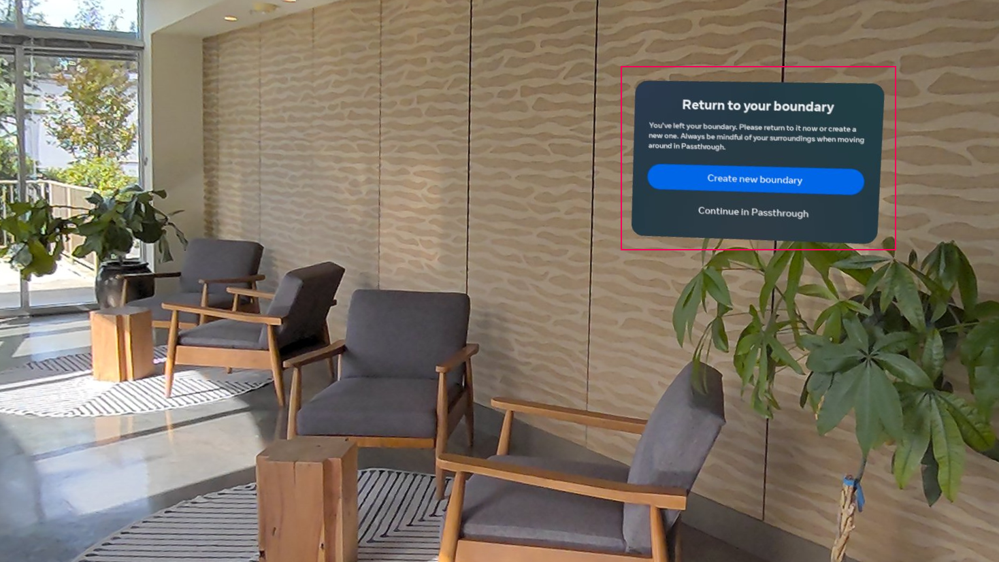
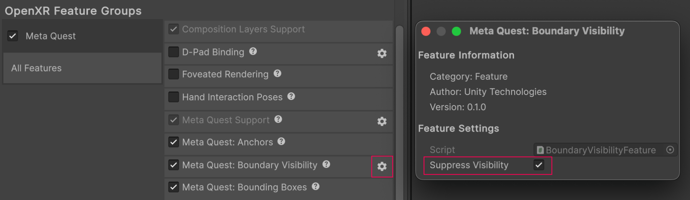

# Boundary visibility

The Meta Quest Boundary Visibility feature enables you to suppress the visibility of the boundary so users can move freely with Passthrough enabled.

 *When boundary visibility isn't suppressed, the system may warn the user when they leave the boundary.*

## Enable the boundary visibility feature

To enable boundary visibility in your app:

1. Go to **Project Settings** > **XR Plug-in Management** > **OpenXR**.
2. Select either the **Windows, Mac, Linux settings** tab to configure Quest Link on Windows, or the **Android settings** tab to configure builds.
3. Under the **OpenXR Feature Groups** heading, select the **Meta Quest** feature group.
4. If disabled, enable the **Meta Quest: Boundary Visibility** OpenXR feature.

 *The Meta Quest feature group, shown with all features enabled.*

<a id="suppress-automatically"/>

## Suppress boundary visibility automatically

If your app is a free-roaming passthrough experience, you might want to hide the boundary when your app starts. Enable the **Suppress Visibility** setting to automatically hide the boundary.

Access the **Suppress Visibility** setting by selecting the gear icon next to the **Meta Quest: Boundary Visibility** feature, as shown in the following image:

 *Supress Visibility setting.*

The boundary remains invisible for the lifetime of the OpenXR loader unless you take further action.

> [!IMPORTANT]
> Boundary visibility can only be suppressed if Passthrough is rendered to the screen.
>
> If your app enables Passthrough sometime after it starts, refer to the following section to change boundary visibility at runtime.

## Change boundary visibility at runtime

Use the `BoundaryVisibilityFeature` scripting API to control the exact timing of when your app requests to change boundary visibility, and receive notifications when boundary visibility changes. Refer to the following example code to understand how to change boundary visibility:

[!code-cs[boundary_visibility](../../Tests/Runtime/CodeSamples/BoundaryVisibilitySample.cs#boundary_visibility)]
