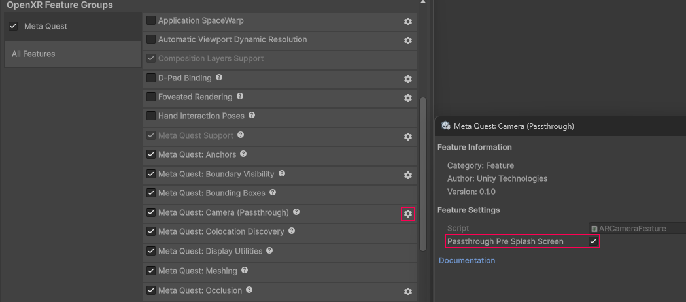
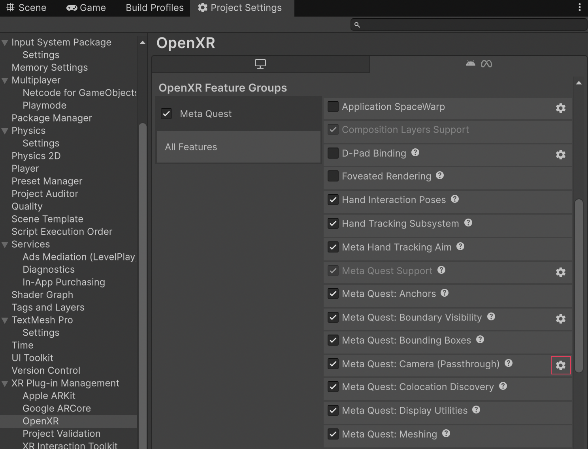
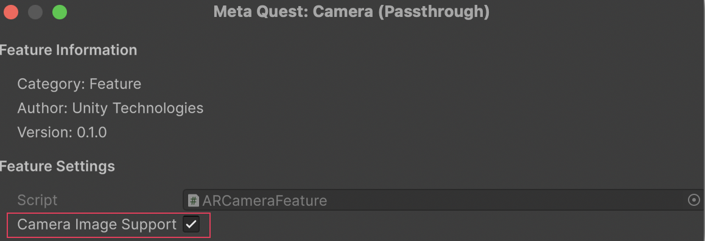

<a id="passthrough"/>

# Camera (Passthrough)

The Meta Quest Camera (Passthrough) feature controls Meta [Passthrough](https://www.meta.com/help/quest/articles/in-vr-experiences/oculus-features/passthrough/), a device capability that captures real-time images of the physical environment and renders them to screen. Your app can use Passthrough to give the user a view of their surroundings while wearing a headset, enabling them to safely move through their space while using your app.

As an AR Foundation provider plug-in, this package implements Passthrough via AR Foundation's camera subsystem, and this page is a supplement to the AR Foundation [Camera](xref:arfoundation-camera) manual. The following sections only contain information about Meta Quest-specific behavior.

[!include]

## Enable Passthrough

To enable the Passthrough capability in your app:

1. Go to **Project Settings** > **XR Plug-in Management** > **OpenXR**.
2. Select either the **Windows, Mac, Linux settings** tab to configure Quest Link on Windows, or the **Android settings** tab to configure builds.
3. Under the **OpenXR Feature Groups** heading, select the **Meta Quest** feature group.
4. If disabled, enable the **Meta Quest: Camera (Passthrough)** OpenXR feature.

 *The Meta Quest feature group, shown with all features enabled.*

<a id="passthrough-pre-splash-screen"/>

### Enable Passthrough splash screen

If your app uses Passthrough, you can replace the default splash screen with a Passthrough splash screen when your app launches to enable a seamless Passthrough experience.

For more information, refer to [Composition Layer Splash Screen](xref:xr-layers-splash-screen).

### Enable Passthrough pre-splash screen

If your app uses Passthrough, you can enable Passthrough before the splash screen is displayed to enable a seamless Passthrough experience. This will override the default opaque startup screen, with a Passthrough background. For more information, visit [Passthrough Loading Screen](https://developers.meta.com/horizon/documentation/native/android/mobile-passthrough-loading-screens/) (Meta developer documentation).

To do this, enable **Passthrough Pre Splash Screen** as follows:

1. Select the gear icon next to the **Meta Quest: Camera (Passthrough)** feature to configure Passthrough settings.
2. Enable **Passthrough Pre Splash Screen**.

 *Passthrough Pre Splash Screen setting.*

## Scene setup

To use Passthrough in your scene, you must have an [AR Camera Manager component](xref:arfoundation-camera-components#ar-camera-manager-component) attached to your camera. Enable the AR Camera Manager component to enable Passthrough, and disable it to disable Passthrough.

### Camera background color

Passthrough requires that your Camera has a transparent background. To do this, set your **Background Color** (Universal Render Pipeline) or **Clear Flags** (Built-In Render Pipeline) to **Solid Color**, with the **Background** alpha channel value set to `0`.

Refer to [Configure camera background for Passthrough](xref:meta-openxr-scene-setup#camera-background-passthrough) for step-by-step instructions.

> [!TIP]
> If Passthrough isn't working in your project after setting the alpha channel value to `0`, ensure your URP settings are correctly configured, as described in [Optimize graphics settings](xref:meta-openxr-graphics-settings#universal-render-pipeline).

<a id="composition-layers"/>

## Composition layers

Unity doesn't have access to pixels or other image data associated with Meta Passthrough images. Instead, Meta's OpenXR runtime submits the images directly to the OpenXR compositor as composition layers. Unity's [XR Composition Layers](xref:xr-layers-index) package provides an interface for authoring your app's composition layers. The Unity OpenXR: Meta Passthrough layer is a custom layer type that you can use to control how Passthrough is composited in your app.

For more information about composition layers, refer to the [Composition layers](xref:xr-layer-overview) package documentation.

### Meta Passthrough layer

If your scene uses Passthrough, by default the camera subsystem will create a GameObject at runtime that enables the Meta Passthrough layer. This `Passthrough` GameObject appears at the root of your scene hierarchy.

 *Passthrough GameObject created at runtime.*

The Passthrough GameObject contains a [Composition Layer component](xref:xr-layers-base-component) that controls the Passthrough layer. Its default **Layer Order** is `-1`, and it uses the **Alpha** blend type.

 *Passthrough GameObject shown in the Inspector window.*

### Customize your composition layers

If you prefer to author your app's composition layers in the Editor, you can [Add a layer in the Editor](xref:xr-layers-add-layer#add-a-layer-in-the-editor) as you normally would when working with the XR Composition Layers package. For your Passthrough layer, choose the **Meta OpenXR - Passthrough** layer type, and [Set the layer sort order in the Editor](xref:xr-layers-order#set-the-layer-sort-order-in-the-editor) to your desired value.

## AR Camera Background component

Meta Passthrough does not require the [AR Camera Background component](xref:arfoundation-camera-components#ar-camera-background-component). If `ARCameraBackground` is in your scene, it will have no effect on Meta Quest devices. If your scene only targets Meta Quest devices, you can safely delete the AR Camera Background component from your XR Origin's **Main Camera** GameObject.

## Image capture

This package supports AR Foundation [Image capture](xref:arfoundation-image-capture) for both CPU and GPU images. The method you choose to access device camera images depends on how you intend to process the image. There are tradeoffs to either a GPU-based or a CPU-based approach.

* **CPU:** Use CPU if you will access the image's pixel data in a C# script. This is more resource-intensive, but allows you to perform operations such as save the image to a file or pass it to a CPU-based computer vision system.
* **GPU:** GPU provides best performance if you will simply render the image or process it with a shader. GPU images provide zero-copy access to camera data, making them ideal for real-time rendering and shader-based processing.

### Enable camera image support

To enable CPU and GPU image support in your app, enable the **Camera Image Support** option as follows:

1. Go to **Project Settings** > **XR Plug-in Management** > **OpenXR**.
2. Select the **Android settings** tab.
3. Under the **OpenXR Feature Groups** heading, select the **Meta Quest** feature group.
4. Click the gear icon next to the **Meta Quest: Camera (Passthrough)** feature.
5. Enable the **Camera Image Support** option.

 *Camera feature settings.*

 *Enable the Camera Image Support setting.*

### Access images via CPU

For information about accessing camera images on the CPU, including synchronous and asynchronous conversion, refer to AR Foundation's [Image capture](https://docs.unity3d.com/Packages/com.unity.xr.arfoundation@latest/manual/features/camera/image-capture.html#access-images-via-cpu) documentation.

> [!NOTE]
> CPU image capture for Meta Quest requires a minimum Android API level `32`. You can set the **Minimum API Level** to **Android 12L (API level 32)** in your project's Player settings. Refer to [Android Player settings](xref:um-class-player-settings-android) for more information.

### Access images via GPU

The following sections describe how to access camera images on the GPU for Meta Quest.

#### Requirements

* **Graphics API:** GPU image capture requires you to set your graphics API to Vulkan as outlined in [Vulkan Graphics API](xref:meta-openxr-graphics-settings). `TryAcquireLatestGpuImage` will return `false` if any other graphics API is selected.
* **Rendering callbacks:** GPU images must be acquired and released during Unity's rendering callbacks ([RenderPipelineManager.beginCameraRendering](xref:UnityEngine.Rendering.RenderPipelineManager.beginCameraRendering(System.Action`2<UnityEngine.Rendering.ScriptableRenderContext,UnityEngine.Camera>)) and [RenderPipelineManager.endCameraRendering](xref:UnityEngine.Rendering.RenderPipelineManager.endCameraRendering(System.Action`2<UnityEngine.Rendering.ScriptableRenderContext,UnityEngine.Camera>))), respectively, to ensure proper synchronization with the graphics pipeline.

> [!NOTE]
> GPU image capture is not supported on Quest Link.

#### Acquire GPU images

> [!NOTE]
> Only acquire one GPU image at a time. Attempting to acquire a new image before releasing the previous one will fail.

To access the device camera image on the GPU, use [MetaOpenXRCameraSubsystem.TryAcquireLatestGpuImage](xref:UnityEngine.XR.OpenXR.Features.Meta.MetaOpenXRCameraSubsystem.TryAcquireLatestGpuImage(UnityEngine.XR.ARSubsystems.XRTextureDescriptor@)) to acquire an [XRTextureDescriptor](xref:UnityEngine.XR.ARSubsystems.XRTextureDescriptor). The descriptor contains a native Vulkan image handle that you can use to create a Unity texture.

The following code sample demonstrates how to acquire GPU images in your project:

[!code-cs[acquire_gpu_image](../../Tests/Runtime/CodeSamples/GpuImageSamples.cs#acquire_gpu_image)]

> [!NOTE]
> GPU images are valid only for the current frame. Do not hold references to GPU images across frames.

#### Release GPU images

> [!IMPORTANT]
> You must release GPU images after use by calling [MetaOpenXRCameraSubsystem.ReleaseGpuImage](xref:UnityEngine.XR.OpenXR.Features.Meta.MetaOpenXRCameraSubsystem.ReleaseGpuImage(UnityEngine.XR.ARSubsystems.XRTextureDescriptor)) with the descriptor returned from `TryAcquireLatestGpuImage`. Failure to release images will prevent acquiring new images and might cause resource leaks.

Release the GPU image using the [MetaOpenXRCameraSubsystem.ReleaseGpuImage](xref:UnityEngine.XR.OpenXR.Features.Meta.MetaOpenXRCameraSubsystem.ReleaseGpuImage(UnityEngine.XR.ARSubsystems.XRTextureDescriptor)) method.