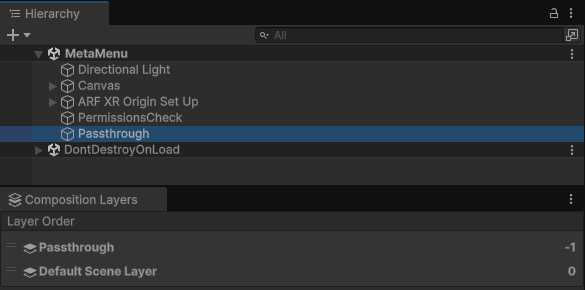
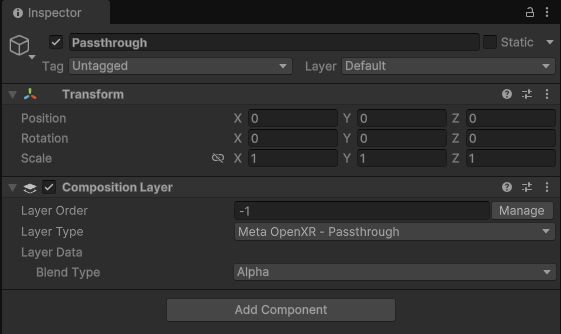

<a id="passthrough"/>

# Camera (Passthrough)

The Meta Quest Camera (Passthrough) feature controls Meta [Passthrough](https://www.meta.com/help/quest/articles/in-vr-experiences/oculus-features/passthrough/), a device capability that captures real-time images of the physical environment and renders them to screen. Your app can use Passthrough to give the user a view of their surroundings while wearing a headset, enabling them to safely move through their space while using your app.

As an AR Foundation provider plug-in, this package implements Passthrough via AR Foundation's camera subsystem, and this page is a supplement to the AR Foundation [Camera](xref:arfoundation-camera) manual. The following sections only contain information about Meta Quest-specific behavior.

[!include]

## Enable Passthrough

To enable the Passthrough capability in your app:

1. Go to **Project Settings** > **XR Plug-in Management** > **OpenXR**.
2. Select either the **Windows, Mac, Linux settings** tab to configure Quest Link on Windows, or the **Android settings** tab to configure builds.
3. Under the **OpenXR Feature Groups** heading, select the **Meta Quest** feature group.
4. If disabled, enable the **Meta Quest: Camera (Passthrough)** OpenXR feature.

 *The Meta Quest feature group, shown with all features enabled.*

## Scene setup

To use Passthrough in your scene, you must have an [AR Camera Manager component](xref:arfoundation-camera-components#ar-camera-manager-component) attached to your camera. Enable the AR Camera Manager component to enable Passthrough, and disable it to disable Passthrough.

### Camera background color

Passthrough requires that your Camera has a transparent background. To do this, set your **Background Color** (Universal Render Pipeline) or **Clear Flags** (Built-In Render Pipeline) to **Solid Color**, with the **Background** alpha channel value set to `0`.

Refer to [Configure camera background for Passthrough](xref:meta-openxr-scene-setup#camera-background-passthrough) for step-by-step instructions.

> [!TIP]
> If Passthrough isn't working in your project after setting the alpha channel value to `0`, ensure your URP settings are correctly configured, as described in [Optimize graphics settings](xref:meta-openxr-graphics-settings#universal-render-pipeline).

<a id="composition-layers"/>

## Composition layers

Unity doesn't have access to pixels or other image data associated with Meta Passthrough images. Instead, Meta's OpenXR runtime submits the images directly to the OpenXR compositor as composition layers. Unity's [XR Composition Layers](xref:xr-layers-index) package provides an interface for authoring your app's composition layers. The Unity OpenXR: Meta Passthrough layer is a custom layer type that you can use to control how Passthrough is composited in your app.

For more information about composition layers, refer to the [Composition layers](xref:xr-layer-overview) package documentation.

### Meta Passthrough layer

If your scene uses Passthrough, by default the camera subsystem will create a GameObject at runtime that enables the Meta Passthrough layer. This `Passthrough` GameObject appears at the root of your scene hierarchy.

 *Passthrough GameObject created at runtime.*

The Passthrough GameObject contains a [Composition Layer component](xref:xr-layers-base-component) that controls the Passthrough layer. Its default **Layer Order** is `-1`, and it uses the **Alpha** blend type.

 *Passthrough GameObject shown in the Inspector window.*

### Customize your composition layers

If you prefer to author your app's composition layers in the Editor, you can [Add a layer in the Editor](xref:xr-layers-add-layer#add-a-layer-in-the-editor) as you normally would when working with the XR Composition Layers package. For your Passthrough layer, choose the **Meta OpenXR - Passthrough** layer type, and [Set the layer sort order in the Editor](xref:xr-layers-order#set-the-layer-sort-order-in-the-editor) to your desired value.

## AR Camera Background component

Meta Passthrough does not require the [AR Camera Background component](xref:arfoundation-camera-components#ar-camera-background-component). If `ARCameraBackground` is in your scene, it will have no effect on Meta Quest devices. If your scene only targets Meta Quest devices, you can safely delete the AR Camera Background component from your XR Origin's **Main Camera** GameObject.

## Image capture

This package does not support AR Foundation [Image capture](xref:arfoundation-image-capture).
