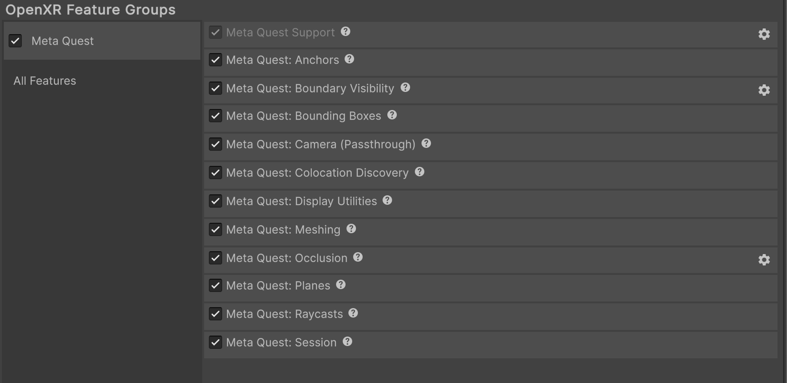

# Meta Quest Occlusion feature

The Meta Quest Occlusion feature allows mixed reality content in your app to appear hidden or partially obscured behind objects in the physical environment. Without occlusion, geometry in your scene will always render on top of physical objects in your [Passthrough](xref:meta-openxr-camera#passthrough) layer, regardless of their difference in depth.

<!-- TODO: add screenshot of occlusion working on device -->

This page is a supplement to the AR Foundation [Occlusion](xref:arfoundation-occlusion) manual. The following sections only contain information about APIs where Meta Quest exhibits unique platform-specific behavior.

[!include]

## Enable occlusion

To enable occlusion in your app:

1. Go to **Project Settings** > **XR Plug-in Management** > **OpenXR**.
2. Select either the **Windows, Mac, Linux settings** tab to configure Quest Link on Windows, or the **Android settings** tab to configure builds for Meta Quest devices.
3. Under the **OpenXR Feature Groups** heading, select the **Meta Quest** feature group.
4. If disabled, enable the **Meta Quest: Occlusion** OpenXR feature.

 *The Meta Quest feature group, shown with all features enabled.*

### Permissions

Your app's user must grant an Android system permission before you can access occlusion data. Refer to [Permissions](xref:meta-openxr-scene-setup#permissions) for more information.

<!-- TODO: what is the expected behavior if permission is not granted? -->

## Hand removal

The Meta Quest Occlusion feature supports the ability to remove the user's hands from the environment depth map. Enable hand removal if your project uses a separate occlusion method for hands.

To enable hand removal:

1. Go to the **Meta Quest: Occlusion** feature in **XR Plug-in Management** for your desired build target.
2. Click the Gear icon (&#9881;), located on the right side of the **Meta Quest: Occlusion** feature.
3. Under **Feature Settings** in the popup window, check the **Enable Hand Removal** checkbox.

 *Enable hand removal.*

If the device does not support hand removal, **Enable Hand Removal** has no effect, and the Meta Quest Occlusion feature logs relevant information to the console.

### Scripting API

The Meta Quest Occlusion feature contains the following APIs that you can use to control hand removal:
* [isHandRemovalSupported](xref:UnityEngine.XR.OpenXR.Features.Meta.MetaOpenXROcclusionSubsystem.isHandRemovalSupported)
* [isHandRemovalEnabled](xref:UnityEngine.XR.OpenXR.Features.Meta.MetaOpenXROcclusionSubsystem.isHandRemovalEnabled)
* [TrySetHandRemovalEnabled](xref:UnityEngine.XR.OpenXR.Features.Meta.MetaOpenXROcclusionSubsystem.TrySetHandRemovalEnabled*)

The following example code shows you how to get the `MetaOpenXROcclusionSubsystem` and enable hand removal at runtime:

[!code-cs[SetHandRemovalEnabled](../../../Tests/Runtime/CodeSamples/OcclusionSamples.cs#SetHandRemovalEnabled)]

<!-- TODO: shaders -->
