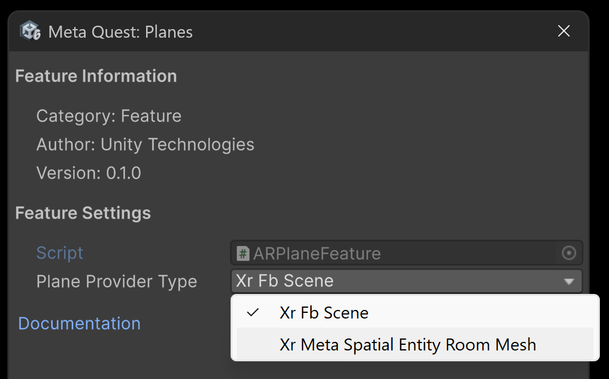

# Planes

This page is a supplement to the AR Foundation [Plane detection](xref:arfoundation-plane-detection) manual. The following sections only contain information about APIs where Meta's OpenXR runtime exhibits unique behavior.

[!include[](../snippets/arf-docs-tip.md)]

<a id="plane-provider-type"></a>

## Plane provider type

Unity OpenXR: Meta implements two plane provider types that correspond to different OpenXR extensions, as described in the following table:

| **Meta plane provider type** | **OpenXR extension** | **Summary** |
| :-------------| :---------- | :---------- |
| `Xr Fb Scene`  | `XR_FB_scene` | Gets all Bounded2D components from the [Scene Model](https://developers.meta.com/horizon/documentation/unity/unity-scene-build-mixed-reality/) (Meta documentation), including tables, couches, wall art, and a simplified representation of the walls, floor, and ceiling. |
| `Xr Meta Spatial Entity Room Mesh` | `XR_META_spatial_entity_room_mesh` | Gets all faces of the room mesh, which provides a higher fidelity representation of the walls, floor, and ceiling, allowing for more detailed surfaces and non-axis-aligned planes. |

> [!NOTE]
> The planes that each provider type discovers and the data associated with discovered planes might vary. Refer to Meta's documentation for more information about the OpenXR extensions used by each provider type.

When you enable the **Meta Quest: Planes**, the plane subsystem uses the `Xr Fb Scene` plane provider type by default.

### Choose plane provider type

You can change the plane provider type your project uses as follows:

1. Go to the **Meta Quest: Planes** feature in **XR Plug-in Management** for your desired build target.
2. Click the Gear icon (&#9881;), located on the right side of the **Meta Quest: Planes** feature.
3. Under **Feature Settings**, select the relevant type from the **Plane Provider Type** dropdown.

> [!NOTE]
> If you choose the `Xr Meta Spatial Entity Entity Room Mesh` and it isn’t available on your device, `Xr Fb Scene` will be used as a fallback.

<br/>*Settings for The Meta Quest: Planes feature, shown with Xr Meta Spatial Entity Room Mesh selected as the Plane Provider Type.*

## Space Setup

Before your app can access planes from Meta's OpenXR runtime, the user must first complete [Space Setup](xref:meta-openxr-device-setup#space-setup) on their device.

Unlike other AR platforms, Meta's OpenXR runtime doesn't dynamically discover planes at runtime. Instead, this provider queries the device's Space Setup data and returns all plane components that are stored in its [Scene Model](https://developer.oculus.com/documentation/native/android/openxr-scene-overview#scene-model). Some entities in the Scene Model, such as Tables or Couches, include planes, while others do not.

> [!IMPORTANT]
> If Space Setup is not complete, AR Foundation cannot access plane data from the device. If your app requires planes, you can use [scene capture](xref:meta-openxr-session#scene-capture) to prompt the user to complete Space Setup.

## Permissions

Your app's user must grant an Android system permission before you can access plane data. Refer to [Permissions](xref:meta-openxr-scene-setup#permissions) for more information.

## Trackable ID

Unlike other AR platforms, the [trackableId](xref:UnityEngine.XR.ARFoundation.ARTrackable`2.trackableId) property of any [ARPlane](xref:UnityEngine.XR.ARFoundation.ARPlane) from Meta's OpenXR runtime persists across multiple sessions in the same space setup. This allows you to, for instance, save the `trackableId` of a user's table to persist a virtual centerpiece on the table each time the user runs your app.

## Plane alignment

Meta's OpenXR runtime doesn't classify planes as horizontal or vertical. Therefore, this package uses a [planeAlignmentThreshold](xref:UnityEngine.XR.OpenXR.Features.Meta.MetaOpenXRPlaneSubsystem.planeAlignmentThreshold) property to determine the threshold for [PlaneAlignment](xref:UnityEngine.XR.ARSubsystems.PlaneAlignment) categorization. Plane alignment is calculated by taking each component of the plane's normal vector and finding their difference from 0. If the difference is less than the `planeAlignmentThreshold`, then the `MetaOpenXRPlaneSubsystem` will categorize the plane depending on which of the normal vector's components are within the threshold. The `x` and `z` components are both checked for horizontal planes while the `y` component is checked for vertical planes.

## Plane classifications

This package maps Meta's native semantic labels to AR Foundation's [PlaneClassifications](xref:UnityEngine.XR.ARFoundation.ARPlane.classifications).

`Xr Fb Scene` uses the [semantic label component](https://developer.oculus.com/documentation/native/android/mobile-scene-api-ref#getting-semantic-label-component).

`Xr Meta Spatial Entity Room Mesh` uses `XrSemanticLabelMETA` for semantic labeling.

Refer to the table below to understand the mapping between AR Foundation's classifications and Meta's semantic labels:

| AR Foundation Label   | Meta Label (Xr Fb Scene) | Meta Label (Xr Meta Spatial Entity Room Mesh) |
| :-------------------- | :----------------------- | :-------------------------------------------- |
| Table                 | TABLE                    |                                               |
| Couch                 | COUCH                    |                                               |
| Floor                 | FLOOR                    | XR_SEMANTIC_LABEL_FLOOR_META                  |
| Ceiling               | CEILING                  | XR_SEMANTIC_LABEL_CEILING_META                |
| WallFace              | WALL_FACE                | XR_SEMANTIC_LABEL_WALL_FACE_META              |
| WallArt               | WALL_ART                 |                                               |
| DoorFrame             | DOOR_FRAME               | XR_SEMANTIC_LABEL_DOOR_FRAME_META             |
| WindowFrame           | WINDOW_FRAME             | XR_SEMANTIC_LABEL_WINDOW_FRAME_META           |
| InvisibleWallFace     | INVISIBLE_WALL_FACE      | XR_SEMANTIC_LABEL_INVISIBLE_WALL_FACE_META    |
| InnerWallFace         |                          | XR_SEMANTIC_LABEL_INNER_WALL_FACE_META        |
| Other                 | OTHER                    |                                               |

## Native pointer

[BoundedPlane.nativePtr](xref:UnityEngine.XR.ARSubsystems.BoundedPlane.nativePtr) values returned by this package contain a pointer to the following struct:

```c
typedef struct UnityXRNativePlane
{
    int version;
    void* planePtr;
} UnityXRNativePlane;
```

Cast the `void* planePtr` to an [XrSpace](https://registry.khronos.org/OpenXR/specs/1.0/html/xrspec.html#spaces) handle in C++ using the following example code:

```cpp
// Marshal the native plane data from the BoundedPlane.nativePtr in C#
UnityXRNativePlane nativePlaneData;
XrSpace* planeXrSpaceHandle = static_cast<XrSpace*>(nativePlaneData.planePtr);
```

To learn more about native pointers and their usage, refer to [Extending AR Foundation](https://docs.unity3d.com/Packages/com.unity.xr.arfoundation@6.0/manual/architecture/extensions.html).
