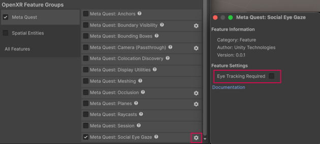

# Social eye gaze

Use per-eye gaze data to animate avatar eyes and build social presence applications.

The Meta Quest Social Eye Gaze feature exposes per-eye gaze direction as a Unity Input System device via the [XR_FB_eye_tracking_social](https://registry.khronos.org/OpenXR/specs/1.1/html/xrspec.html#XR_FB_eye_tracking_social) OpenXR extension. You can use the Social Eye Gaze feature for social presence applications, such as animating avatar eye bones to reflect where the user is looking.

The feature returns gaze poses in head-relative (view) space. You can use the returned gaze poses directly to drive avatar eye bones without requiring any camera or XR Origin transform.

## Prerequisites

To use the Meta Quest Social Eye Gaze feature, your project must meet the following requirements:

* The target device must support eye tracking (Meta Quest Pro).
* Your app's Android manifest must declare the `com.oculus.permission.EYE_TRACKING` permission and the `oculus.software.eye_tracking` uses-feature entry. When you enable this feature, the package automatically injects both entries at build time. The runtime permission request must be handled by your app, for example using the `PermissionsManager` component from XR Interaction Toolkit.
    > [!TIP]
    > XR Interaction Toolkit provides a `PermissionsManager` script that enables users to request permissions at runtime. You can add this component to a scene and use it to request `com.oculus.permission.EYE_TRACKING`.
* For development over [Meta Horizon Link](xref:meta-openxr-link), enable **Eye tracking over Oculus Link** in the **Beta** tab of the Meta Horizon Link app.

## Enable Social Eye Gaze

To enable the Meta Quest Social Eye Gaze feature in your app:

1. Go to **Project Settings** > **XR Plug-in Management** > **OpenXR**.
2. Under **OpenXR Feature Groups**, select the **All Features** feature group.
3. Enable the **Meta Quest: Social Eye Gaze** OpenXR feature.

### Configure eye tracking requirement

When the Meta Social Eye Gaze feature is enabled, the package automatically injects the following entries into your Android manifest at build time:

- `com.oculus.permission.EYE_TRACKING`: required by the Android OS to grant the app access to eye tracking hardware at runtime.
- `oculus.software.eye_tracking`: declares that the app uses eye tracking hardware. The `required` attribute controls whether devices without eye tracking can install the app.

By default, `required` is set to `false`, which means a user can install your app on any Meta Quest device. On devices without eye tracking support, the feature disables itself at runtime.

To configure the eye tracking requirement setting, click the gear icon next to **Meta Quest: Social Eye Gaze** in **Project Settings** > **XR Plug-in Management** > **OpenXR**.

<br/>*The Social Eye Gaze feature settings shown with the required field disabled.*

In the settings window, enable **Eye Tracking Required**. This sets `android:required="true"` on the `oculus.software.eye_tracking` manifest entry. Setting `required` to `true` restricts app installation to devices that have eye tracking hardware, which is appropriate if eye tracking is central to your app's experience.

## Access gaze data

When enabled, this feature registers a [MetaSocialEyeGazeDevice](xref:UnityEngine.XR.OpenXR.Features.Meta.MetaSocialEyeGazeDevice) with the Unity Input System. The device becomes available as [MetaSocialEyeGazeDevice.current](xref:UnityEngine.XR.OpenXR.Features.Meta.MetaSocialEyeGazeDevice.current) once a session starts and the hardware is ready.

Use a [TrackedPoseDriver](xref:UnityEngine.InputSystem.XR.TrackedPoseDriver) or bind input [Actions](xref:input-system-actions) to the following device controls:

| **Control** | **Type** | **Description** |
| :---------- | :------- | :-------------- |
| `leftEyePose` | `PoseControl` | Left eye gaze pose in head space. |
| `leftEyePose/position` | `Vector3` | Left eye gaze position in head space. |
| `leftEyePose/rotation` | `Quaternion` | Left eye gaze rotation in head space. |
| `rightEyePose` | `PoseControl` | Right eye gaze pose in head space. |
| `rightEyePose/position` | `Vector3` | Right eye gaze position in head space. |
| `rightEyePose/rotation` | `Quaternion` | Right eye gaze rotation in head space. |
| `leftEyeConfidence` | `float` | Confidence of the left eye gaze pose, in the range [0, 1]. |
| `rightEyeConfidence` | `float` | Confidence of the right eye gaze pose, in the range [0, 1]. |
| `leftEyeIsValid` | `bool` | Whether the left eye gaze data is valid. |
| `rightEyeIsValid` | `bool` | Whether the right eye gaze data is valid. |

> [!NOTE]
> Each of these input action bindings is searchable in the **Input Action Asset** window that you can use to drive the `TrackedPoseDriver`.

> [!TIP]
> If eye tracking stops working when using Input Actions over Meta Horizon Link with **Enter Play Mode > Reload Domain** disabled, add an [InputActionManager](xref:input-system-component-inputactionmanager) component to your scene and assign your Input Action Asset to its **Action Assets** list. Without domain reload, Input Action Assets are not automatically re-enabled between play sessions; `InputActionManager` handles this.

### Access gaze data with scripts

You can also access the `MetaSocialEyeGazeDevice` controls via scripts.

> [!NOTE]
> Always check `leftEyeIsValid`, `rightEyeIsValid`, or the eye pose's `trackingState` before reading gaze data. The runtime sets these to `false` when the eye is not tracked or when the user hasn't granted the Android permission. The user can grant permission mid-session. Once granted, gaze data begins flowing without requiring a session restart.

The following example reads the left eye gaze rotation, position, confidence, and validity from the current `MetaSocialEyeGazeDevice`:

```csharp
var gazeDevice = MetaSocialEyeGazeDevice.current;
if(gazeDevice == null)
    return;

var leftEyeRotation = gazeDevice.leftEyePose.rotation.ReadValue();
var leftEyePosition = gazeDevice.leftEyePose.position.ReadValue();
var leftEyeConfidence = gazeDevice.leftEyeConfidence.ReadValue();
var leftEyeIsValid = gazeDevice.leftEyeIsValid.isPressed;
```

## Additional resources

* [Android Manifest](xref:um-android-manifest) (Unity User Manual)
