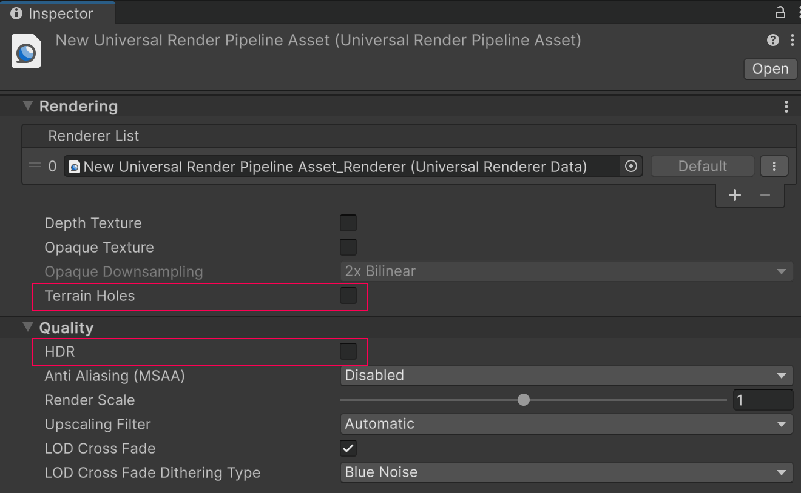
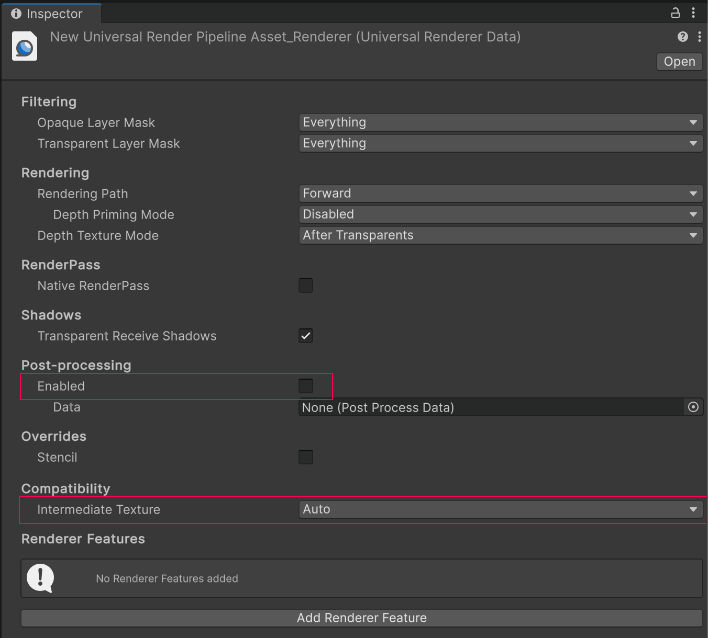

# Optimize graphics settings

The following sections outline specific graphics settings for Meta Quest devices for optimal performance and Passthrough.

## Vulkan Graphics API

Meta [recommends](https://developer.oculus.com/documentation/unity/unity-conf-settings/#rendering-settings) that you use the Vulkan Graphics API in your project, as some newer features for Meta Quest devices are only supported with that API.

To change your project's Graphics API to Vulkan, follow these steps:

1. Go to **Edit** > **Project Settings** > **Player**.
2. Select the Android tab and open **Other Settings**.
3. In the **Rendering** section, if **Auto Graphics API** is enabled, disable this setting to reveal the **Graphics APIs** section.
4. Under **Graphics APIs**, click the **Add** button (**+**) to add a new Graphics API.
5. Select **Vulkan**.
6. Re-order the Graphics APIs using the handles (**=**) so that **Vulkan** is listed first.
7. Optionally, select any other Graphics APIs and click the **Remove** button (**-**) to remove them.

## Universal Render Pipeline

Meta Quest is compatible with the Universal Render Pipeline (URP), but the default URP settings don't enable optimal Passthrough performance on Quest.

Refer to the following table for a list of Unity's recommended settings, which are explained in greater detail in the following sections.

| Setting                  | Location                        | Recommended value |
| :----------------------- | :------------------------------ | :---------------- |
| **Terrain Holes**        | Universal Render Pipeline Asset | Disabled |
| **HDR**                  | Universal Render Pipeline Asset | Disabled |
| **Post-processing**      | Universal Renderer Data         | Disabled |
| **Intermediate Texture** | Universal Renderer Data         | **Auto** |

### Universal Render Pipeline Asset settings

To optimize your Universal Render Pipeline Asset for Meta Quest:

1. Locate your project's Universal Render Pipeline Asset. One way to do this is to type `t:UniversalRenderPipelineAsset` into the **Project** window's search bar.

    > [!TIP]
    > If your project does not contain a Universal Render Pipeline Asset, refer to [Installing the Universal Render Pipeline into an existing Project](https://docs.unity3d.com/Packages/com.unity.render-pipelines.universal@14.0/manual/InstallURPIntoAProject.html) from the URP docs.

2. In the **Inspector**, under the **Rendering** header, disable **Terrain Holes**.
3. Under the **Quality** header, disable **HDR**.

 *Universal Render Pipeline Asset shown with recommended settings.*

### Universal Renderer Data settings

To optimize your Universal Renderer Data for Meta Quest:

1. Locate your project's Universal Renderer Data Asset. One way to do this is to type `t:UniversalRendererData` into the **Project** window's search bar.
2. In the **Inspector**, under the **Post-processing** header, uncheck **Enabled**.
3. Under the **Compatibility** header, set the **Intermediate Texture** value to **Auto**.

 *Universal Renderer Data shown with recommended settings.*

## Additional resources

* [Optimization techniques for untethered XR devices](https://docs.unity3d.com/Packages/com.unity.render-pipelines.universal@17.0/manual/xr-untethered-device-optimization.html) (URP documentation)
* [XR platform system requirements](xref:um-system-requirements#xr)
