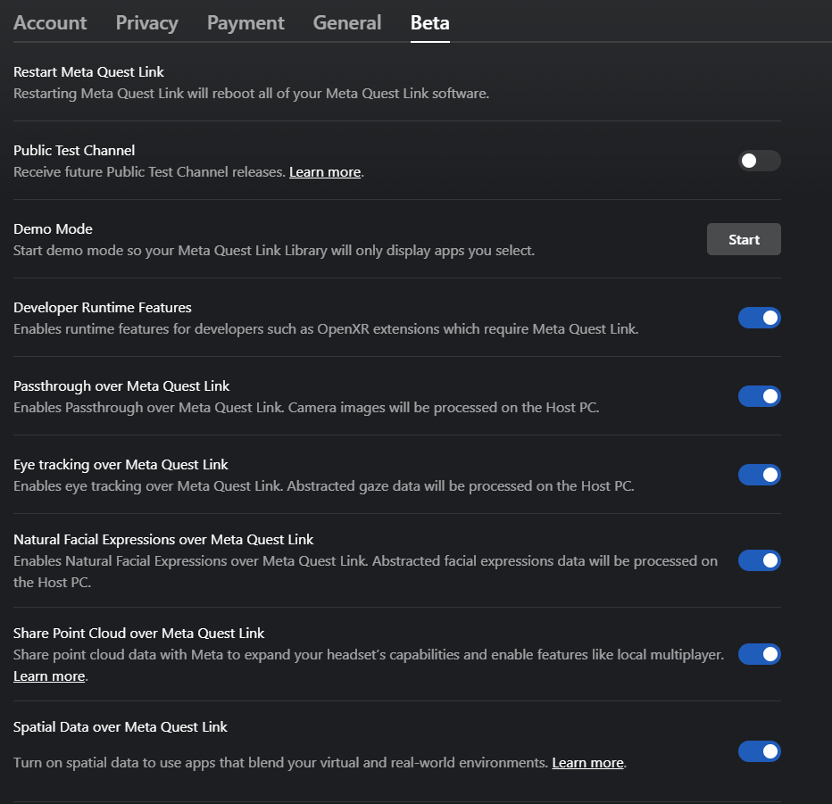

# Meta Quest Link

For faster iteration time, you can use Meta Quest Link to run your project on your Meta Quest headset directly from the Unity Editor. Using Link removes the need to build and deploy your app every time you want to test your changes.

> [!IMPORTANT]
> Meta Quest Link is only supported on Windows.

## Set up and enable Meta Quest Link

1. [Set up Meta Quest Link](https://www.meta.com/help/quest/articles/headsets-and-accessories/oculus-link/set-up-link/) on your PC.
2. Go to **Edit** > **Project Settings** > **XR Plug-in Management**.
3. In the Windows, Mac, Linux tab, under **Plug-in Providers**, disable **XR Simulation** if it is enabled, and enable **OpenXR**.
4. While still in the **Project Settings** window, go to **XR Plug-in Management** > **OpenXR**.
5. In the Windows, Mac, Linux tab, under **Interaction Profiles**, add **Oculus Touch Controller Profile**.
6. Under **OpenXR Feature Groups**, enable the **Meta Quest** feature group.

Now when you enter Play mode, the current scene plays in both your headset and the **Game** view.

> [!NOTE]
> Although the Android build target is required to build your app for Meta Quest devices, Standalone project settings apply in Play mode.

## Enable experimental features

Some Link features including Passthrough and spatial data are experimental. For these features to work, you must enable these features in the Meta Quest Link desktop app under **Settings** > **Beta**. Note that Passthrough video does not render in the **Game** view.

 *The Meta Quest Link desktop app beta settings.*

## Additional resources

* [Troubleshoot issues with Meta Quest Link](https://www.meta.com/en-gb/help/quest/975178886590868/) (Meta documentation)
