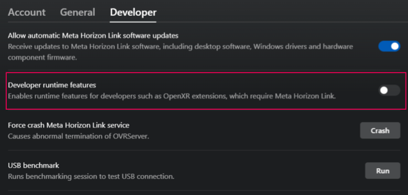
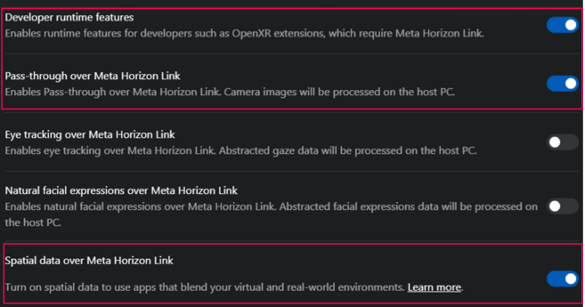

# Configure Meta Horizon Link

Configure Meta Horizon Link for faster iteration.

For faster iteration time, you can use Meta Horizon Link to run your project on your Meta Quest headset directly from the Unity Editor. Using Link removes the need to build and deploy your app every time you want to test your changes.

> [!IMPORTANT]
> Meta Horizon Link is only supported on Windows.

## Set up and enable Meta Horizon Link

To enable Meta Horizon Link:

1. [Set up Meta Horizon Link](https://www.meta.com/help/quest/articles/headsets-and-accessories/oculus-link/set-up-link/) on your PC.
2. Go to **Edit** > **Project Settings** > **XR Plug-in Management**.
3. In the **Windows, Mac, Linux** tab, under **Plug-in Providers**, disable **XR Simulation** if it's enabled, and enable **OpenXR**.
4. While still in the **Project Settings** window, go to **XR Plug-in Management** > **OpenXR**.
5. In the **Windows, Mac, Linux** tab, under **Interaction Profiles**, add **Oculus Touch Controller Profile**.
6. Under **OpenXR Feature Groups**, enable the **Meta Quest** feature group.

When you enter Play mode, the current scene plays in both your headset and the **Game** view.

> [!NOTE]
> Although the Android build target is required to build your app for Meta Quest devices, Standalone project settings apply in Play mode.

## Enable developer features

Some Link features (including Passthrough) are available as developer features. For these features to work, you must enable developer features as follows:
1. Open the **Settings** window and select the **Developer** tab.
1. Enable **Developer runtime features** to reveal additional developer settings.
 *Enable Developer runtime features to reveal and enable additional developer settings.*
1. Enable the following developer features to ensure OpenXR Meta features work over Link:
  * **Pass-through over Meta Horizon Link**
  * **Spatial data over Meta Horizon Link**
 *When you enable Developer runtime features, you can enable additional developer features.*

> [!NOTE]
> Passthrough video does not render in the **Game** view.

## Additional resources

* [Troubleshoot issues with Meta Horizon Link](https://www.meta.com/en-gb/help/quest/975178886590868/) (Meta documentation)
