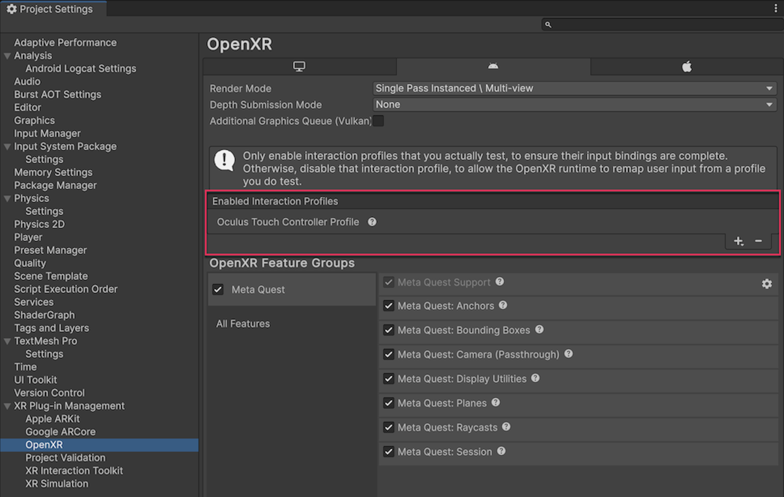

# Configure project settings

Use the **Project Settings** window to enable Meta OpenXR features and add the Oculus Touch Controller Profile to your project.

<a id="enable-openxr-features"/>

## Prerequisites

You must have the Android module installed in the version of the Unity Editor you're using. Refer to [Add modules](https://docs.unity3d.com/hub/manual/AddModules.html) for more information.

## Enable Meta OpenXR features

To use any feature in this package, you must enable the corresponding OpenXR Feature in the **Meta Quest** feature group. Otherwise, your app can't access these features.

To enable the features in this package:

1. Go to **Edit** > **Project Settings** > **XR Plug-in Management**. If you don't already have it installed, click **Install XR Plug-in Management**.
2. In the Android tab, under **Plug-in Providers**, enable **OpenXR** and **Meta Quest feature group**.
3. While still in the **Project Settings** window, go to **XR Plug-in Management** > **OpenXR**.
4. Under **OpenXR Feature Groups**, enable the **Meta Quest** feature group.
5. To enable only the features relevant to your project, click on the **Meta Quest** feature group, and select the relevant features.

 *The Meta Quest OpenXR feature group, shown with all features enabled.*

> [!NOTE]
> XR Plug-in Management supports only one enabled plug-in provider at a time per build target. If your project also targets ARCore using the [Google ARCore XR Plug-in](https://docs.unity3d.com/Packages/com.unity.xr.arcore@6.0), to avoid errors you should disable the **Google ARCore** plug-in provider in the Android tab of **Project Settings** > **XR Plug-in Management** before you build an APK for Meta Quest devices. Likewise, you should disable **OpenXR** before you build for ARCore.

## Add the Oculus Touch Controller Profile

To add the Oculus Touch Controller Profile:

1. Go to **Edit** > **Project Settings** > **XR Plug-in Management**.
2. In the Android tab, under **Plug-in Providers**, enable **OpenXR**.
3. While still in the **Project Settings** window, go to **XR Plug-in Management** > **OpenXR**.
4. In the Android tab, under **Enabled Interaction Profiles**, add **Oculus Touch Controller Profile**.

 *The Oculus Touch Controller Profile is the enabled controller profile.*

## Graphics settings

Refer to [Graphics settings](xref:meta-openxr-graphics-settings) to understand the required and recommended graphics settings for your Meta OpenXR project.

## Additional resources

* [Oculus Touch Controller Profile](xref:openxr-oculus-touch-controller-profile) (Unity OpenXR plug-in documentation)
