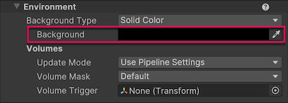
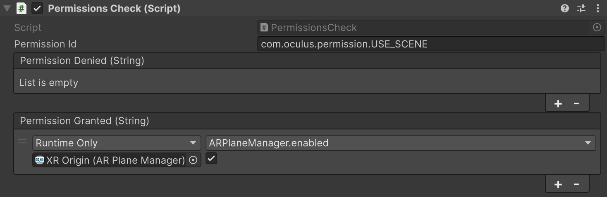

# Set up your scene

To set up your scene to use Unity OpenXR: Meta, first follow the standard AR Foundation [Scene setup](xref:arfoundation-scene-setup) instructions. The following sections detail additional setup steps specific to projects that target Meta's OpenXR runtime.

## Configure input actions

Ensure that the **Tracked Pose Driver** component on your camera has "centerEyePosition [XR HMD]" included in the position and rotation input actions.

<a id = "camera-background-passthrough"/>

## Configure camera background for Passthrough

The Passthrough camera captures real-time images of the external environment to provide the user with a view of their surroundings while wearing a headset.

Meta Passthrough requires that your camera has a transparent background.

> [!NOTE]
> The Passthrough video is layered behind the image rendered by the scene camera. If you configure the camera's background color (or clear flags) to use a skybox or an opaque solid color, then the Passthrough video is covered up by the camera background.

After you have completed the AR Foundation scene setup steps, follow these instructions to configure your scene to render with a transparent camera background:

1. Locate the GameObject named **XR Origin** in your GameObject hierarchy. (Refer to [Scene setup](xref:arfoundation-scene-setup) in the AR Foundation manual for instructions on how to set up the scene if it doesn't already contain an **XR Origin**.)
2. Expand the hierarchy to reveal the **Camera Offset** and **Main Camera** GameObjects.
3. Inspect the **Main Camera** GameObject.
4. Select from the following options. The options differ based on the render pipeline you're using:
    * URP: In the **Environment** section, set the **Background Type** to **Solid Color**.
    * Built-In Render Pipeline: Set **Clear Flags** to **Solid Color**.
5. Select the **Background** color to open the color picker.

 *Camera background color picker in the Inspector window.*

6. Set the color's **A** (alpha) value to `0`.

Your scene is now configured to support Meta Passthrough.

<a id="permissions"/>

## Permissions

Meta's OpenXR runtime requires your app to obtain an Android system permission before you can use any [Space Setup](xref:meta-openxr-device-setup#space-setup) data. Your user must grant your app the `com.oculus.permission.USE_SCENE` permission before you can access any data associated with planes, bounding boxes, meshes, or occlusion.

If your scene uses AR Foundation's [ARPlaneManager](xref:arfoundation-plane-arplanemanager), [ARBoundingBoxManager](xref:arfoundation-bounding-box-arboundingboxmanager), [ARMeshManager](xref:arfoundation-meshing), or [AROcclusionManager](xref:arfoundation-occlusion-manager) components, you should disable them, because they can't do any work without the required system permission. After your app receives permission, you can safely enable these manager components.

### Scene permission example

The following example code shows you one way to implement permission management with a MonoBehaviour:

[!code-cs[scene-permission](../../Tests/Runtime/CodeSamples/PermissionsCheck.cs#scene-permission)]

> [!NOTE]
> The AR Foundation Samples GitHub repository includes a working demo of the [PermissionsCheck](https://github.com/Unity-Technologies/arfoundation-samples/blob/main/Assets/Scenes/Meta/PermissionsCheck.cs) component.

To use this example code, add the Permissions Check component to a GameObject in your AR scene. Then in the **Inspector**, subscribe to either the **Permission Denied** or **Permission Granted** events by clicking the **Add** (**+**) button.

 *Permissions Check component set up to enable the AR Plane Manager component when permission is granted.*

## Additional resources

* [Passthrough](xref:meta-openxr-camera#passthrough)
* [Graphics settings](xref:meta-openxr-graphics-settings)
