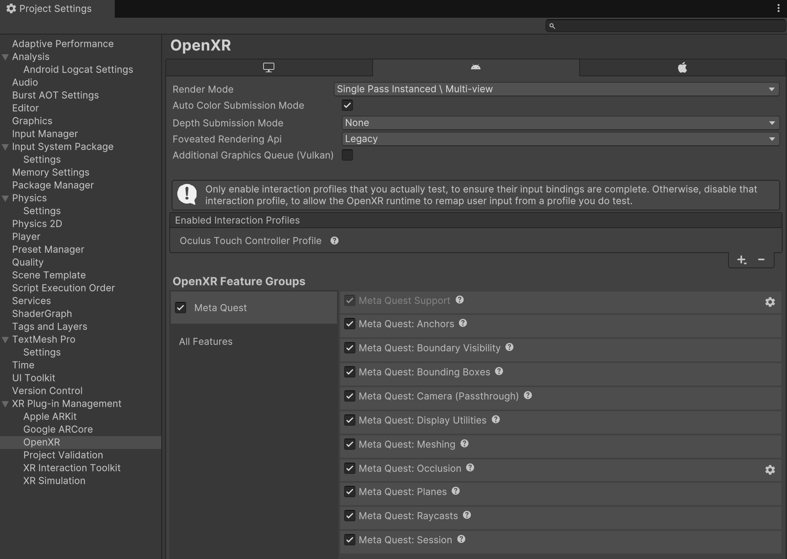

# Unity OpenXR: Meta

Unity OpenXR: Meta enables Meta Quest device support for your AR Foundation projects and provides a C# interface for Meta's OpenXR runtime. This package depends on both [AR Foundation](https://docs.unity3d.com/Packages/com.unity.xr.arfoundation@5.1) and the [OpenXR Plug-in](https://docs.unity3d.com/Packages/com.unity.xr.openxr@1.7).

## Getting started

To enable the features in this package, go to **Project Settings** > **XR Plug-in Management** > **OpenXR** > **OpenXR Feature Groups** and enable the **Meta Quest** feature group as shown below:

 *The Meta Quest OpenXR feature group, shown with all features enabled*

> [!IMPORTANT]
> To use any feature in this package, you must enable the corresponding OpenXR Feature in the **Meta Quest** feature group. Otherwise, your app cannot access these features.

### Setup instructions

Refer to [Device setup](xref:meta-openxr-device-setup) and [Project setup](xref:meta-openxr-project-setup), respectively, for more detailed information about how to set up your Meta Quest device and Unity project to use this package.

Refer to [Meta Quest Link](xref:meta-openxr-link) to use Meta Quest Link with Play mode in the Unity Editor.

## Features

[!include]

## A quick primer on OpenXR

OpenXR is an open-source standard that defines an interface between XR apps and platform runtimes. The OpenXR specification contains two categories of features: _core features_, which are present on every platform, and _extensions_, which are optional and may not be implemented by some platforms.

Unity's [OpenXR Plug-in](https://docs.unity3d.com/Packages/com.unity.xr.openxr@1.7) integrates core features, while this package integrates Meta-specific vendor extensions. Refer to [Architecture](xref:meta-openxr-architecture) for a full list of OpenXR extensions that this package uses.

## Requirements

To use Unity OpenXR: Meta, your project must meet the following requirements:

* Unity 2022.3 or newer
* AR Foundation 5.1.0 or newer
* OpenXR 1.7 or newer

When you install this package, if you don't already have AR Foundation or OpenXR in your project, the Package Manager will automatically install these dependencies.
