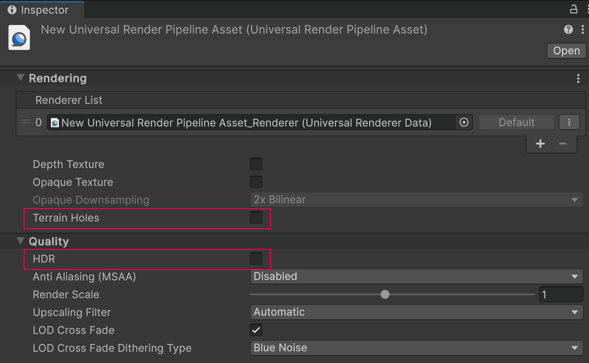
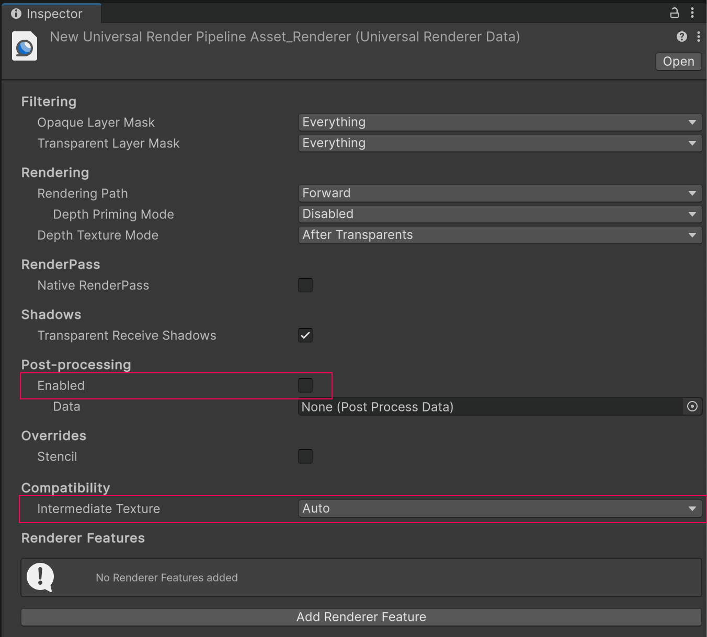

# Project settings

To enable the Unity OpenXR: Meta in your project, follow the steps below:

1. Go to **Edit** > **Project Settings** > **XR Plug-in Management**.
2. In the Android tab, under **Plug-in Providers**, enable **OpenXR**.
3. While still in the **Project Settings** window, go to **XR Plug-in Management** > **OpenXR**.
4. In the Android tab, under **Enabled Interaction Profiles**, add **Oculus Touch Controller Profile**.
5. Under **OpenXR Feature Groups**, enable the **Meta Quest** feature group.

 *The Meta Quest OpenXR feature group*

> [!NOTE]
> XR Plug-in Management supports only one enabled plug-in provider at a time per build target. If your project also targets ARCore using the [Google ARCore XR Plug-in](https://docs.unity3d.com/Packages/com.unity.xr.arcore@6.0), to avoid errors you should disable the **Google ARCore** plug-in provider in the Android tab of **Project Settings** > **XR Plug-in Management** before you build an APK for Meta Quest devices. Likewise, you should disable **OpenXR** before you build for ARCore.

## Vulkan Graphics API

Meta [recommends](https://developer.oculus.com/documentation/unity/unity-conf-settings/#rendering-settings) that you use the Vulkan Graphics API in your project, as some of the newer features for Meta Quest devices are only supported with that API.

To change your project's Graphics API to Vulkan, follow these steps:

1. Go to **Edit** > **Project Settings** > **Player**.
2. Select the Android tab and open **Other Settings**.
3. In the **Rendering** section, if **Auto Graphics API** is enabled, disable this setting to reveal the **Graphics APIs** section.
4. Under **Graphics APIs**, click the **Add** button (**+**) to add a new Graphics API.
5. Select **Vulkan**.
6. Re-order the Graphics APIs using the handles (**=**) so that **Vulkan** is listed first.
7. Optionally, select any other Graphics APIs and click the **Remove** button (**-**) to remove them.

## Universal Render Pipeline

Meta Quest is compatible with the Universal Render Pipeline (URP), but the default URP settings are not suitable for best Passthrough performance on Quest. Refer to the table below for a list of Unity's recommended settings, which are explained in greater detail in the following sections.

| Setting                  | Location                        | Recommended value |
| :----------------------- | :------------------------------ | :---------------- |
| **Terrain Holes**        | Universal Render Pipeline Asset | Disabled |
| **HDR**                  | Universal Render Pipeline Asset | Disabled |
| **Post-processing**      | Universal Renderer Data         | Disabled |
| **Intermediate Texture** | Universal Renderer Data         | **Auto** |

### Universal Render Pipeline Asset settings

Follow the steps below to optimize your Universal Render Pipeline Asset for Meta Quest:

1. Locate your project's Universal Render Pipeline Asset. One way to do this is to type `t:UniversalRenderPipelineAsset` into the **Project** window's search bar.

    > [!TIP]
    > If your project does not contain a Universal Render Pipeline Asset, refer to [Installing the Universal Render Pipeline into an existing Project](https://docs.unity3d.com/Packages/com.unity.render-pipelines.universal@14.0/manual/InstallURPIntoAProject.html) from the URP docs.

2. In the **Inspector**, under the **Rendering** header, disable **Terrain Holes**.
3. Under the **Quality** header, disable **HDR**.

 *Universal Render Pipeline Asset shown with recommended settings*

### Universal Renderer Data settings

Follow the steps below to optimize your Universal Renderer Data for Meta Quest:

1. Locate your project's Universal Renderer Data Asset. One way to do this is to type `t:UniversalRendererData` into the **Project** window's search bar.
2. In the **Inspector**, under the **Post-processing** header, uncheck **Enabled**.
3. Under the **Compatibility** header, set the **Intermediate Texture** value to **Auto**.

 *Universal Renderer Data shown with recommended settings*
